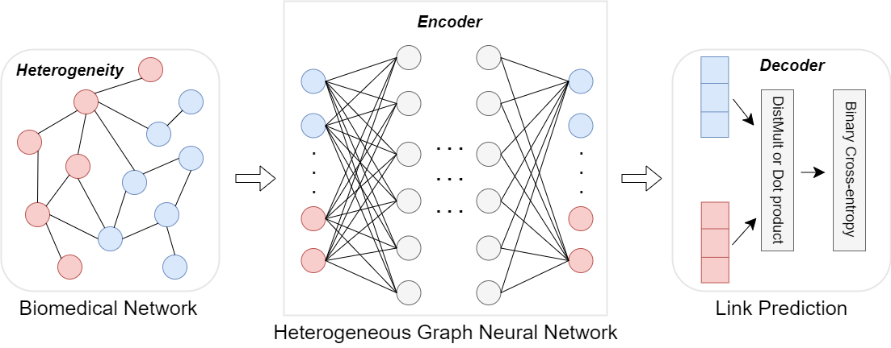

### Heterogeneous Graph Neural Networks for Link Prediction in Biomedical Networks
Our aim is to evaluate the performance of recent publicly available heterogeneous graph neural networks in link prediction on biomedical networks. At the same time, comparing these universal heterogeneous graph neural networks with state-of-the-art biomedical methods, the results show that these advanced heterogeneous graph neural networks can be applied to prediction tasks in the biomedical field, and show encouraging results in complex biomedical networks, which are worth further exploration.  



## Dataset
* [DeepViral-Net](data/DeepViral-Net), [ProGO-Net](data/ProGO-Net), [NeoDTI-Net](data/NeoDTI-Net) and [deepDR-Net](data/deepDR-Net): four complex biomedical networks are downloaded from [https://github.com/pengsl-lab/BioERP.git](https://github.com/pengsl-lab/BioERP.git).
* [CTD-DDA](data/CTD_DDA), [NDFRT-DDA](data/NDFRT_DDA), [DrugBank-DDI](data/DrugBank_DDI) and [STRING-PPI](data/STRING_PPI): four single biomedical networks are downloaded from [https://github.com/xiangyue9607/BioNEV.git](https://github.com/xiangyue9607/BioNEV.git).

## Code
The heterogeneous graph neural networks for RGCN, CompGCN, RGAT, HAN, HPN, ieHGCN, HetSANN, HGT, SimpleHGN uses the code from [OpenHGNN](https://github.com/BUPT-GAMMA/OpenHGNN). To ensure the successful execution of their code, we need to install the environment according to their requirements [Get Started](https://github.com/BUPT-GAMMA/OpenHGNN?tab=readme-ov-file#get-started).

## Link Prediction
After configuring the environment, you can run the existing models in the biomedical dataset. Run the command as follows
```
cd code
python main.py -m model_name -d dataset_name -t task_name -g 0 --use_best_config --load_from_pretrained
```
_optional arguments:_  
`-m` name of model, `-d` name of dataset, `-t` name of task, `-g` which gpu to use, if not set -1  
`--use_best_config` use the best config in the dataset with the model  
`--load_from_pretrained` load model from default checkpoint   

_for example:_
```
python main.py -m RGCN -d NDFRT_DDA -t link_prediction -g 0 --use_best_config
```
we are using RGCN model to test the DDA prediction performance in the [NDFRT-DDA](data/NDFRT_DDA) dataset.

## Node Classification
_for example:_
```
python main.py -m RGCN -d HNE-PubMed -t node_classification -g 0 --use_best_config
```
We are using the RGCN model to predict which category a disease node in the PubMed dataset belongs to.

## Parameter Analysis
If you want to set different hyper-parameters, manually modify [config.ini](code/openhgnn/config.ini). The best config will override the parameter in config.ini. 
